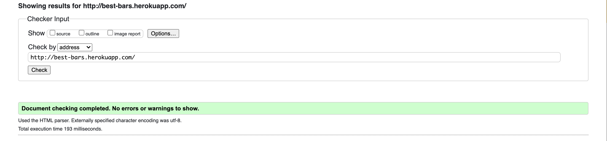
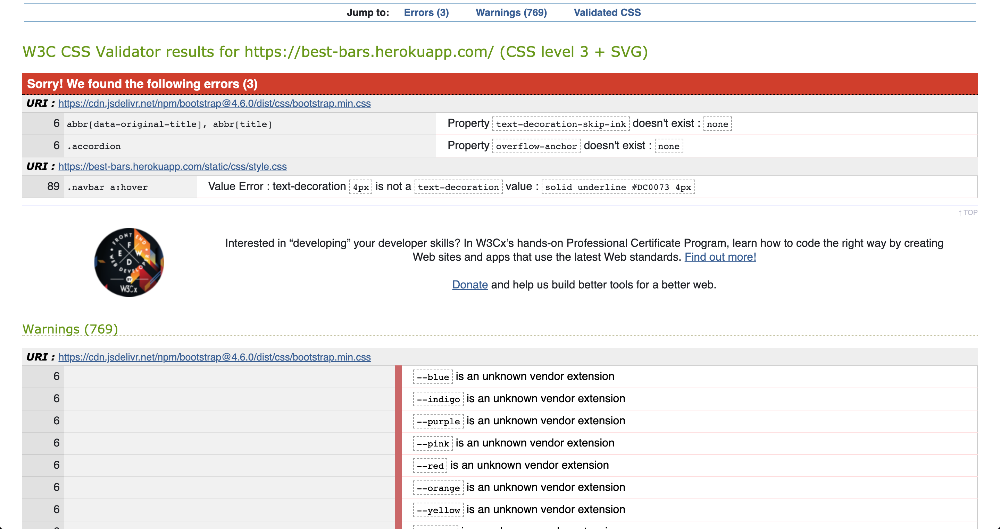
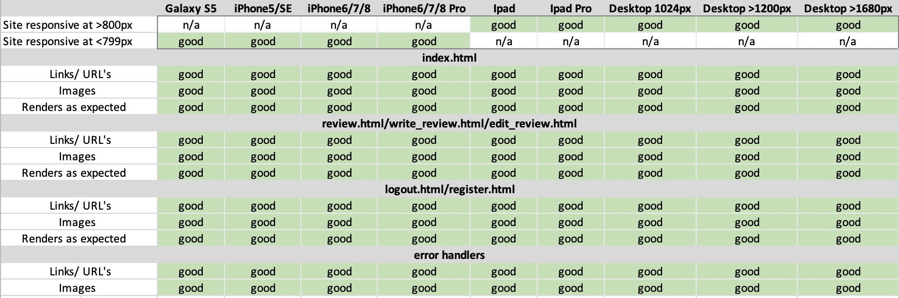
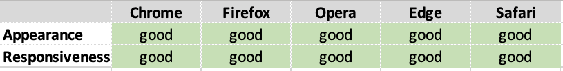

<h1>Testing</h1>

---

## Index 

- <a href="#validators">1. Code Validators</a>
- <a href="#responsiveness">2. Responsiveness</a>
- <a href="#browser-compatibility">3. Browser Compability</a>
- <a href="#user-stories">4. Testing User Stories </a>
- <a href="#defensive-design">5. Defensive Design</a>

---

<span id="validators"></span>

## 1. Code validators
 - **[HTML Validator](https://validator.w3.org/):** No errors to show.

    

- **[CSS Validator](https://jigsaw.w3.org/css-validator/):** No errors found.


- **[JS Hint](https://jshint.com/):** No errors found, no warnings, one undefined variable 
    - 1 undefined variable: $

- **[Python validator | PEP8](http://pep8online.com/):** No errors found


---

<span id="responsiveness"></span>

## 2. Responsiveness 
- Responsiveness of the application is tested with [Chrome DevTools](https://developers.google.com/web/tools/chrome-devtools) and [Responsive Design Checker](https://www.responsivedesignchecker.com/).
- The application is tested on the following devices: 
    - Desktop: 1024px, 1366px, 1440px, 1600px and 1680px. 
    - Mobile & Tablet: Galaxy S5, iPhone 5/SE, iPhone 6/7/8, iPhone 6/7/8 plus, iPhone x, iPad and  iPad Pro



---

<span id="browser-compatibility"></span>

## 3. Browser compatibility


--- 

<span id="user-stories"></span>

## 4. Testing user stories 

### First-time visitor goals:
1. As a first time visitor, I want to be able to visit the website on every device, so that I can look at the website on desktop, mobile and tablet. 
    - The first time visitor can visit the website on a computer, laptop, tablet and phone.
2. As a first time visitor, I want to be able to navigate easily through the website, so I can find everything easily. 
    - The first time visitor can navigate through the website with the navbar. The navbar is on top of the website. For the mobile visitors there is a hamburger menu. 
3. As a first time visitor, I want to see all reviews, so I can get ideas of where to go.
    - The first time visitor can visit all reviews by clicking on reviews in the navbar.  On this page there are all the reviews posted by users.  
4. As a first time visitor, I want to be able to search reviews based on words, so I can find reviews easily. (For example, I can search for the word mezcal and all reviews with the mezcal or Stockholm in the review will appear.)
    - In the navbar there is a searchbar, where first time visitors can search for words.  
5. As a first time visitor, I want to register an account on the website, so I can share my reviews. 
    - The first time visitor can navigate to the register page by clicking on register button in the navbar.


### Site member goals
1. As a site member, I want to add my reviews, so I can share my reviews with others.
    - A site member can add reviews by clicking on 'write Review' in the navbar. 
2. As a site member, I want to edit my reviews, so I can update/correct information in the review.
3. As a site member, I want to delete my reviews, so I can remove the review when I don't want it to be shared anymore. 
    - A site member can delete a review on the reviews page. There is a button by each review, to delete the review. 
4. As a site member, I want to login so I can add a review, edit and delete my reviews. 
    - A site member can login by clicking on login in the navbar. 
5. As a site member, I want to logout of my profile, so I can be logged out. 
    - As a site member is logged in they can logout by clicking on logout in the navbar.

### Admin goals
1. As a site owner, I want to provide the user with a description about the purpose of the site 
    - There is a description for the website at the top of the landing page.
2. As a site owner, I want to include a navigation bar to allow users to easily and intuitively navigate to other pages on the site 
    - There is a search bar that searches for any instances of the word in the navbar available on all pages, including the hamburger menu.
3. As a site owner, I want to provide the user with access to reviews without having to create an account 
    - Users that are not logged in can view the reviews page.
    4. As a site owner, I want to allow the user to easily sign up for an account to allow them to write their own reviews 
    - There is a link to the registration page in the navbar and the fields required are few and easy to fill in making it an easy ux. I find it a bad ux when there are too many fields to fill in and often will leave the site.
5. As a site owner, I want to allow the user to easily edit and delete any reviews thay've added to the site 
    - There are edit and delete buttons at the bottom of a users reviews allowing them to go to the edit page where they can edit the review or delete it.
6. As a site owner, I want all visitors and registered users to be able to easily contact me through email or social media platforms 
    - There is an email adress and social media icons in the footer of the page where users can contact me.

---
<span id="defensive-design"></span>

## 5. Defensive design 

1. The user is not able to break the site by clicking on any of the buttons. 

**Answer 1:** All buttons on the website work. The buttons on the website consist of  buttons that lead to other pages or submit buttons to add, edit or delete something from the database.

2. The register form: 
    - 2.1 The username has to be between 2-20 characters.
    - 2.2 The password has to be between 2-20 characters.        
3. The add and edit review form:
    - 3.1 The review name has to be between 2-30 characters.
        - The validation for the review name is done with front end validation.
4. For the email field, the email must include the @ symbol.

**Answer 2 + 3 + 4:** 
The validation of all input fields is done with front end validation. 

- The input fields accept a minimum and maximum length of characters. This is done with minlength and maxlength. 
- The required functionality is used to make the input fields required. 

See below the input fields for front end validation:
    
    ```
    Register: 
             <input type="text" class="form-control" id="username" name="username" minlength="2" maxlength="20"    placeholder="Username" required />
              <input type="email" class="form-control" id="emailaddress" name="email" minlength="10" placeholder="Email" required />
              <input type="password" class="form-control" id="password" name="password" minlength="2" maxlength="20" placeholder="Password" required />

    Add and edit review:
              <input type="text" class="form-control" name="bar_name" id="name" placeholder="Bar Name" minlength="2" maxlength="30" required />
              <textarea rows="5" class="form-control" name="review" id="review" placeholder="Review" minlength="5" maxlength="400" required ></textarea>
              <input type="text" class="form-control" name="fav_drink" id="fav_drink" placeholder="Fav Drink" minlength="2" maxlength="50" required />
                <input type="text" class="form-control" name="location" id="location" placeholder="Location" minlength="5" maxlength="50" required />

    ``` 

5. A review can't be deleted by just one click. If someone clicks on the delete button, there wil be a pop up asking if the user is sure they want to delete the review.

**Answer 5:** If someone clicks on the delete button, a modal (from bootstrap) will pop up with the text: Are you sure you want to delete the review. If the user clicks again on delete the review will be deleted from the database.

---

[Go to README.md file](README.md).